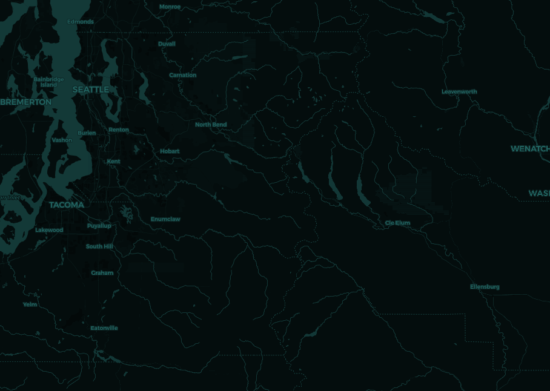
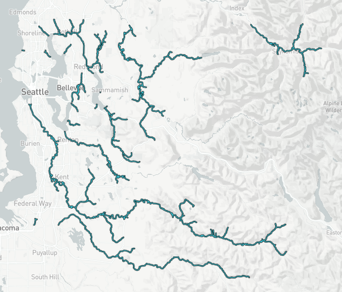
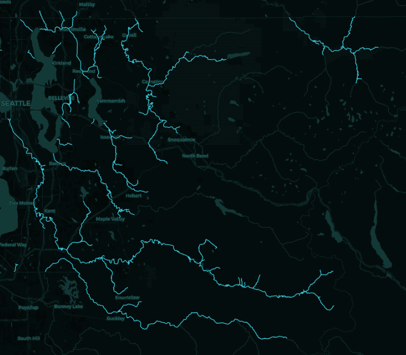
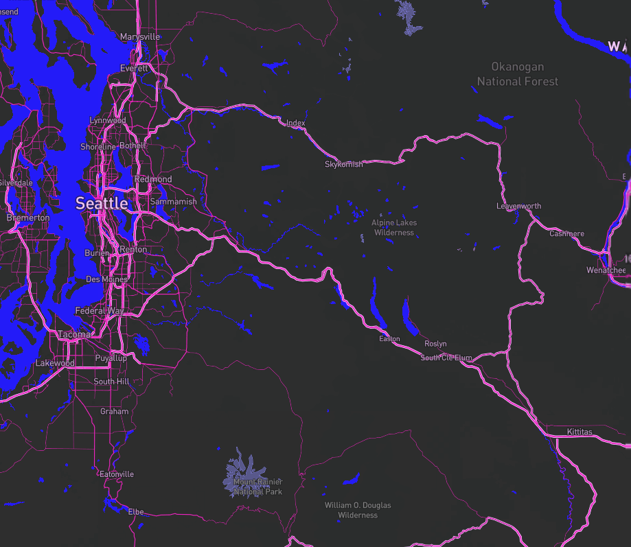

# Lab 4: Map Tiles

## URL To Map:

https://kje123.github.io/map_tiles_geog458/

## Description and layers

For my map, I decided to map out the general King County area, as well as create a map of different Chinook salmon distributions within the King County area. I made my map with 14 different zoom layers.

### Layer 1: Basemap

This is the CartoDB basemap I chose, and I modified it by changing the hue to be a nice turqoise blue.

### Layer 2: Salmon

This is the geospatial data I chose to map, which is the distribution of Chinook Salmon runs in King County.

### Layer 3: Basemap + Salmon

This is the salmon data mapped over the basemap.

### Layer 4: Bisexual flag colors

This is a custom basemap I made in Mapbox Studio, using the colors of the bisexual flag. Bi pride baby! :)

